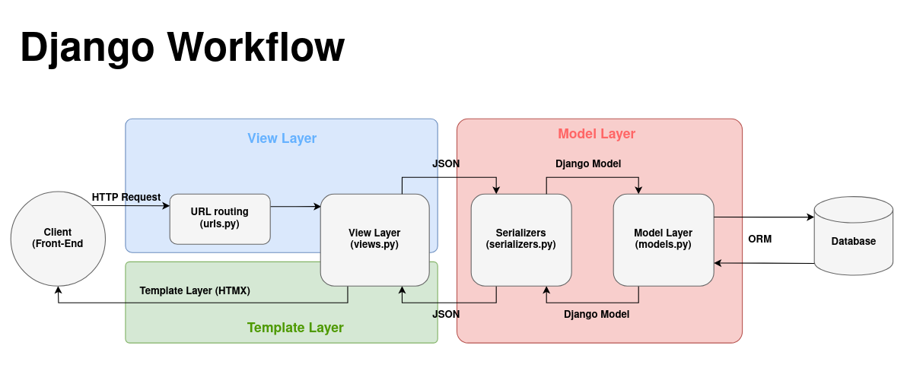

# How does Django work

Django is made of 3 main layers. They communicate as the following figure shows.



## Models Layer
 
Where we define Models to represent and manipulate the data of the application. Written in python classes, they map SQL tables to a high level syntax. This SQL table...

```SQL
CREATE TABLE User(
	id PRIMARY KEY,
	username VARCHAR(64) NOT NULL,
	password VARCHAR(255) NOT NULL,
	email VARCHAR(255) NOT NULL
) 
```
...can be represented by the following model:

```python
from django.db import models

class User(models.Model):
	id = models.AutoField(primary_key=True)
    username = models.CharField(max_length=64)
    password = models.CharField(max_length=255)
    email = models.EmailField()
```

We take advantage of python syntax, not only to write a database schema but also to make queries to the database.

## View Layer

Ensure encapsulation of the request-response logic

